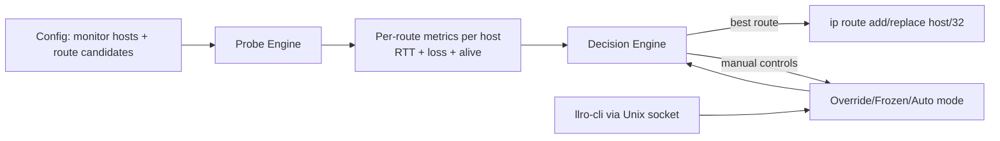
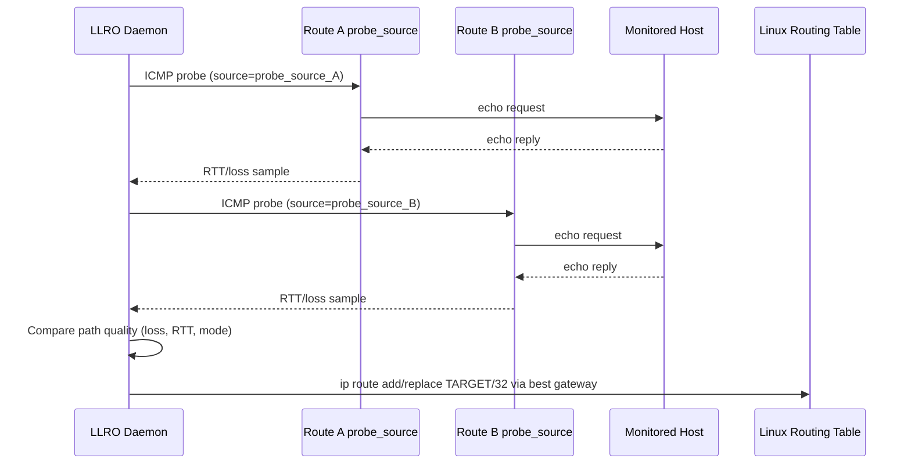

# HOW LLRO Works

LLRO continuously chooses the best uplink for each monitored destination host and installs a `/32` route for that host.
It probes paths, compares health, and updates Linux routes automatically.

## High-Level Flow

## Packet Flow

## Main Components

- Probe Engine: Sends ICMP probes for each monitored host from each configured route source.
- Decision Engine: Ranks candidate routes by packet loss first, then RTT, while respecting mode and thresholds.
- Route Applier: Writes host-specific Linux routes using `ip route add/replace`.
- Admin Control Plane: `llro-cli` talks to the daemon over a local Unix socket for status, override, freeze, and reset.

## What Is Sent and Applied

- Sent: ICMP probe packets from each `probe_source` to each monitored host.
- Collected: route quality metrics (`avg_rtt`, `avg_loss`, `is_alive`) per host/path.
- Applied: `/32` destination routes on the host:
`ip route add|replace <host>/32 via <gateway> dev <device> src <probe_source>`.

## Decision Outcome

- Healthy best path available: route is switched or kept on that best path.
- Path degraded: switch can occur based on loss/RTT threshold logic.
- Manual override/freeze active: automatic switching is constrained by selected mode.
- No valid path: optional fallback route is used, otherwise host route is removed.
